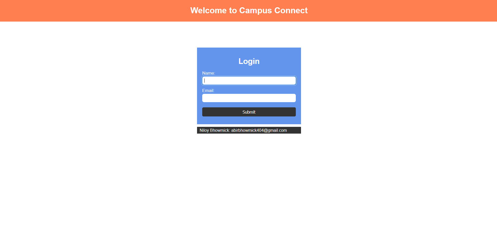

# Login Page Project

This is a simple Login Page created with HTML, CSS, and JavaScript.
## Demo

## Features
- User Login Form
- Form Validation
- Error Message Handling

## Technologies Used
- HTML5
- CSS3
- JavaScript

## How to Run
1. Download the project or clone the repository.
2. Open `index.html` file in your browser.

## Author
Abir Bhowmick
